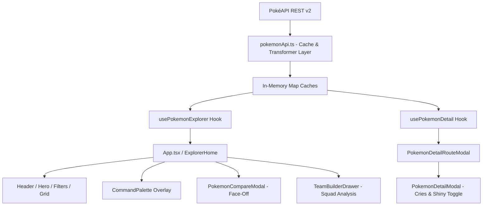

# ⚡ Pokédex Explorer

> A production-grade, portfolio-quality Pokémon discovery web application built with **React 19**, **TypeScript**, **Vite**, **Tailwind CSS (v3)**, and **React Router 7**, powered by the live public **PokéAPI**.

[](https://react.dev/)
[](https://www.typescriptlang.org/)
[](https://vitejs.dev/)
[](https://tailwindcss.com/)
[](https://oxc.rs/)
[](LICENSE)

---

> ### 🚀 **Live Production Demo**: [https://pokemon-internship-assessment.vercel.app](https://pokemon-internship-assessment.vercel.app)

---

## 🌟 Why This Stands Out

Unlike standard Pokédex lookup clones, this application is engineered with high-value product features and analytical depth:

- 🛡️ **6-Slot Battle Squad Builder with Live Defensive Synergy Analysis**: Add Pokémon to a persistent battle team that automatically computes shared weaknesses ($\ge 2\times$ damage taken) and uncovered attack threats against a full 18-type effectiveness matrix.
- 📊 **"Explain This Stat" Derived Percentile Insights**: Evaluates raw base stats against competitive percentile tiers (e.g., *"Top 15% High Tier! Speed higher than 85% of Pokémon"*).
- 🎯 **Pokédex Discovery Tracker**: Tracks unique entries viewed across sessions (`Discovered: N / 1302`), reframing the lookup app into an engaging discovery experience.
- ✨ **3D Mouse-Tilt Hover Effect & Audio Cry Playback**: Hardware-accelerated 3D trading-card tilt with parallax artwork depth, shiny sprite toggle, and live PokéAPI cry sound playback.

---

## 📌 Table of Contents

- [📸 Interface & Visual Preview](#-interface--visual-preview)
- [✨ Feature Highlights](#-feature-highlights)
  - [🔍 Core Discovery & Search](#-core-discovery--search)
  - [📖 Rich Detail & Biology](#-rich-detail--biology)
  - [⚡ Power Tools & Differentiators](#-power-tools--differentiators)
  - [🛠️ Architectural & DX Highlights](#️-architectural--dx-highlights)
- [🛠️ Tech Stack](#️-tech-stack)
- [🌐 API Endpoints Used](#-api-endpoints-used)
- [🏗️ Architecture & Data Flow](#️-architecture--data-flow)
- [📁 Project Structure](#-project-structure)
- [💻 Local Setup & Installation](#-local-setup--installation)
- [🚀 Deployment Guide](#-deployment-guide)
- [💡 Challenges Faced & Engineering Decisions](#-challenges-faced--engineering-decisions)
- [🔮 Future Roadmap](#-future-roadmap)
- [📜 License](#-license)

---

## 📸 Interface & Visual Preview

| View Component | Description | ASCII Layout |
|---|---|---|
| **Main Explorer** | Soft light theme with 3D trading card tilt, search bar, 18-type filter pills, and live count badges | `[ Search Bar \| Type Pills \| 20 Card Grid ]` |
| **Detail Modal & Cries** | Species flavor text, physical traits, audio cry player, shiny toggle, and stat percentile insights | `[ Flavor Text \| Cry Player \| Stat Bars ]` |
| **Side-by-Side Face-Off** | Paired base stat comparison with `▲` winner indicators and total BST evaluation banner | `[ Pokémon A vs Pokémon B \| Paired Bars ]` |
| **6-Slot Squad Builder** | Battle squad drawer with live 18-type defensive coverage matrix analysis | `[ 6 Slots \| Shared Weakness Matrix ]` |

### Terminal & Desktop Explorer Mockup
```text
+-----------------------------------------------------------------------------------+
|  [Pokéball] Pokédex Explorer    Loaded: 20/1302   [⌘K]   [⚔️ VS 2/2]   [❤️ 4] ☀️ |
+-----------------------------------------------------------------------------------+
|                                                                                   |
|    ⚡ Discover the World of Pokémon                                               |
|    Search by name or Pokédex ID...                         [🔍 Search]            |
|                                                                                   |
|    [All] [🔥 Fire] [💧 Water] [🌿 Grass] [⚡ Electric] ... (18 Types with Emojis)    |
|    Sort by: [ID] [Name] [Type]   Direction: [Asc ↑]   [ ] Favorites Only          |
+-----------------------------------------------------------------------------------+
|  +----------------+  +----------------+  +----------------+  +----------------+  |
|  | #0001     [VS] |  | #0004     [VS] |  | #0007     [VS] |  | #0025     [VS] |  |
|  |   [Bulbasaur]  |  |  [Charmander]  |  |   [Squirtle]   |  |   [Pikachu]    |  |
|  |  (🌿 Grass)    |  |    (🔥 Fire)   |  |   (💧 Water)   |  |  (⚡ Electric)  |  |
|  | HP 45 ATK 49   |  | HP 39 ATK 52   |  | HP 44 ATK 48   |  | HP 35 ATK 55   |  |
|  +----------------+  +----------------+  +----------------+  +----------------+  |
+-----------------------------------------------------------------------------------+
```

---

## ✨ Feature Highlights

### 🔍 Core Discovery & Search

- **Debounced Instant Search**: Live 300ms debounced input searching by Pokémon name or Pokédex ID (`/` keyboard shortcut to focus, `Esc` to clear).
- **18-Type Filter Bar**: Filter by elemental type with custom contrast-compliant badges and type emojis (e.g. 🔥 Fire, 💧 Water, ⚡ Electric, 🌿 Grass).
- **Smart Type Effectiveness Tooltips**: Hovering over any type pill displays a floating tooltip showing top 2 "Weak against" and top 2 "Strong vs" types.
- **Multi-Sort & Direction**: Sort by ID, Name, or Primary Type in ascending or descending order.
- **Favorites System**: Heart toggle backed by `localStorage` persistence and dedicated filter mode.
- **Responsive Theme Switcher**: Defaults to soft light theme (`#F8FAFC`) with full dark mode (`#0F172A`) support.

### 📖 Rich Detail & Biology

- **Species Flavor Text**: Integrates `/pokemon-species/{name}` endpoint for official Pokédex entries and genus classifications (e.g. *"Seed Pokémon"*).
- **PokéAPI Audio Cry Player**: Stream official Pokémon cry audio (`sprites.cries.latest`) with animated bounce icons.
- **✨ Shiny Sprite Toggle**: Toggle between normal and shiny official artwork with a smooth 200ms opacity crossfade.
- **"You Might Also Like" Recommendations**: Displays type-matched recommendations from the in-memory cache.
- **Physical Metrics**: Displays height and weight formatted in metric ($m$, $kg$) and imperial ($ft$, $lbs$).

### ⚡ Power Tools & Differentiators

- **⚔️ Side-by-Side Pokémon Face-Off (Compare View)**: Select 2 Pokémon to view paired stat bars, `▲` stat winner indicators, and total Base Stat Total (BST) winner evaluation.
- **🛡️ 6-Slot Battle Squad Builder**: Persistent 6-slot squad tray with live defensive synergy analysis (identifying shared weaknesses and uncovered threats).
- **📊 "Explain This Stat" Intelligence**: Hover over stat bars to view competitive percentile rankings (e.g. *"High Tier Speed"*).
- **🎯 Pokédex Completion Ring**: Live counter tracking unique entries opened across sessions.
- **⌘K Command Palette**: Keyboard-first quick search modal accessible via `Ctrl+K` / `Cmd+K`.

### 🛠️ Architectural & DX Highlights

- **GPU-Accelerated 3D Tilt**: Hardware-accelerated 3D mouse tilt with parallax artwork depth (`translateZ(25px)`) and radial glare overlay (automatically disabled on touch devices).
- **Pure React Hooks Architecture**: Strict state updater purity preventing render-phase side effects or loop depth warnings.
- **SPA Deep Linking**: Direct URL routing to `/pokemon/:name` with Vercel and Netlify rewrite configurations.

---

## 🛠️ Tech Stack

| Category | Technology | Version |
|---|---|---|
| **Core Framework** | React | `v19.0.0` |
| **Language** | TypeScript (Strict Mode) | `v5.7.2` |
| **Build Tooling** | Vite | `v8.2.1` |
| **Styling & Design** | Tailwind CSS + PostCSS | `v3.4.17` |
| **Icons** | Lucide React | `v0.475.0` |
| **Routing** | React Router | `v7.1.5` |
| **Code Quality** | Oxlint | `v0.15.10` |
| **API Integration** | PokéAPI REST v2 | Live |

---

## 🌐 API Endpoints Used

**Base URL**: `https://pokeapi.co/api/v2/`

| Endpoint | Method | Description |
|---|---|---|
| `/pokemon?limit=20&offset=N` | `GET` | Paginated summary roster retrieval |
| `/pokemon/{name}` | `GET` | Full detail fetch by Pokémon name |
| `/pokemon/{id}` | `GET` | Full detail fetch by Pokédex ID |
| `/type/{type}` | `GET` | Roster list of Pokémon associated with a given type |
| `/pokemon-species/{name}` | `GET` | Pokédex flavor text entry & genus classification |

---

## 🏗️ Architecture & Data Flow



---

## 📁 Project Structure

```text
src/
├── components/
│   ├── common/
│   │   ├── Badge.tsx           # Type pill badge with icons & hover matchup tooltips
│   │   ├── CommandPalette.tsx  # ⌘K / Ctrl+K keyboard quick search
│   │   ├── EmptyState.tsx      # Contextual empty search/filter views
│   │   ├── ErrorState.tsx      # Network error banner with retry trigger
│   │   ├── LoadingSkeleton.tsx # Shimmer loading skeletons
│   │   └── ScrollToTop.tsx     # Floating scroll-to-top button
│   ├── filters/
│   │   ├── SearchBar.tsx       # Debounced input with keyboard shortcuts
│   │   ├── SortSelector.tsx    # ID / Name / Type sort + Asc/Desc toggle
│   │   └── TypeFilterBar.tsx   # Horizontally scrollable 18-type pill selector
│   ├── layout/
│   │   ├── Footer.tsx          # API attribution & keyboard legend
│   │   ├── Header.tsx          # Brand logo, counts, compare & squad triggers
│   │   └── Hero.tsx            # Hero banner with embedded search bar
│   └── pokemon/
│       ├── FavoriteButton.tsx  # Heart toggle with pop animation
│       ├── PokemonCard.tsx     # 3D tilt card, artwork float & quick stats
│       ├── PokemonCompareModal.tsx # Side-by-side Pokémon stat face-off
│       ├── PokemonDetailModal.tsx # Full detail modal, audio cry & shiny toggle
│       ├── PokemonGrid.tsx     # State machine grid (Skeleton -> Cards)
│       ├── PokemonStats.tsx    # Animated base stat bars & percentile insights
│       └── TeamBuilderDrawer.tsx  # 6-slot squad builder & type coverage matrix
├── config/
│   ├── pokemonTypes.ts         # Type color tokens, WCAG contrast & emoji icons
│   └── typeEffectiveness.ts    # 18x18 type effectiveness chart matrix
├── hooks/
│   ├── useDebounce.ts          # Search debouncer (300ms)
│   ├── useFavorites.ts         # LocalStorage favorite manager
│   ├── useFocusTrap.ts         # Accessible modal focus trap
│   ├── useLocalStorage.ts      # Resilient localStorage hook with async event sync
│   ├── usePokedexCompletion.ts # Discovered entries tracker
│   ├── usePokemonCompare.ts    # Global side-by-side compare manager
│   ├── usePokemonDetail.ts     # Single Pokémon detail fetcher
│   ├── usePokemonExplorer.ts   # Main filter pipeline & pagination coordinator
│   ├── useTeamBuilder.ts       # 6-slot battle team manager
│   └── useTheme.ts             # Light/Dark/System theme switcher
├── services/
│   └── pokemonApi.ts           # PokéAPI client with Map caches & view-models
├── types/
│   └── pokemon.ts              # Strongly-typed Raw API & UI interfaces
├── utils/
│   └── pokemon.ts              # ID formatting, metric conversion, stat helpers
├── App.tsx                     # Main application layout & route setup
├── main.tsx                    # React root entry point
└── index.css                   # Tailwind directives & custom CSS keyframes
```

---

## 💻 Local Setup & Installation

### Prerequisites
- **Node.js**: `v18.0.0` or higher
- **npm**: `v9.0.0` or higher

### Step-by-Step Commands

```bash
# 1. Clone the repository
git clone https://github.com/yash2595/Pokemon-Internship-Assessment-.git
cd Pokemon-Internship-Assessment-

# 2. Install dependencies
npm install

# 3. Start development server
npm run dev

# 4. Run TypeScript build & Oxlint audit
npm run build
npx oxlint

# 5. Preview production build locally
npm run preview
```

---

## 🚀 Deployment Guide

### Deploying to Vercel (CLI or GitHub)

1. **Option A: Vercel CLI**:
   ```bash
   npx vercel --prod
   ```

2. **Option B: GitHub Integration**:
   - Push repository to GitHub.
   - Import project into Vercel Dashboard.
   - Build settings are auto-detected (`npm run build`, output directory `dist`).

The [`vercel.json`](file:///c:/Users/hp/Downloads/Pokemon%20Explorer/vercel.json) rewrite rule handles SPA routing fallback for hard refreshes on `/pokemon/:name`:
```json
{
  "rewrites": [{ "source": "/(.*)", "destination": "/index.html" }]
}
```

---

## 💡 Challenges Faced & Engineering Decisions

### 1. Pure React Hooks & State Updaters (React 19 Compatibility)
- **Challenge**: State updater functions (`setStoredValue((prev) => ...)`) containing side-effect event dispatches (`window.dispatchEvent`) caused React 19 to log update depth warnings and hook queue errors during concurrent renders.
- **Solution**: Refactored `useLocalStorage.ts` to execute state updates as pure functions, deferring custom window event dispatches asynchronously via `setTimeout(..., 0)`.

### 2. Eliminating Cross-Component Render Collisions
- **Challenge**: Calling `usePokemonExplorer` inside `PokemonDetailRouteModal` triggered state updates on `ExplorerHome` while `PokemonDetailRouteModal` was rendering, causing React cross-component update warnings.
- **Solution**: Created a pure, synchronous cache lookup function (`getCachedSimilarPokemon`) in `pokemonApi.ts` that retrieves type recommendations directly from memory without invoking React hooks or `setState`.

### 3. Tailwind v3 Spring Curves & Custom Timing
- **Challenge**: Standard Tailwind CSS transition utilities lacked support for custom spring easing curves like `cubic-bezier(0.34, 1.25, 0.64, 1)`.
- **Solution**: Extended `tailwind.config.js` with `duration-600` (`600ms`) and `ease-spring` tokens, backed by direct inline style fallbacks in `PokemonStats.tsx`.

---

## 🔮 Future Roadmap

- 🧬 **Interactive Evolution Chain Visualizer**: Node graph displaying complete evolution trees (e.g. Pichu $\rightarrow$ Pikachu $\rightarrow$ Raichu) with level/item requirements.
- 📱 **Offline PWA Support**: Service worker integration for offline caching of previously loaded Pokémon artwork and sound effects.
- ⚔️ **Battle Damage Simulator**: Interactive move damage calculator evaluating attack stats against defender type matchups.

---

## 📜 License

MIT License © 2026. Designed & developed for technical evaluation.
