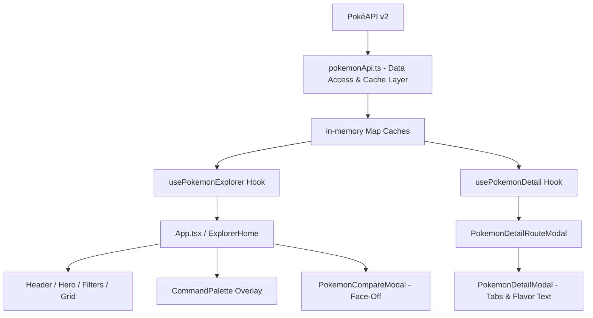

# ⚡ Pokédex Explorer

> A production-grade, portfolio-quality Pokémon discovery web application built with **React 19**, **TypeScript**, **Vite**, **Tailwind CSS (v3)**, and **React Router 7**, powered by the live public **PokéAPI**.

[](https://www.typescriptlang.org/)
[](LICENSE)

> **Deployment Note**: SPA rewrite fallback configuration (`vercel.json` & `public/_redirects`) is pre-configured and ready. Run `npx vercel` to publish your live production URL.

---

## 📸 Interface Overview

### Desktop Explorer & Detail Modal
```
+-----------------------------------------------------------------------------------+
|  [Pokéball Icon] Pokédex Explorer    Loaded: 20/1302   [⌘K]  [⚔️ VS 0/2]  [❤️ 0] ☀️ |
+-----------------------------------------------------------------------------------+
|                                                                                   |
|    ⚡ Discover the World of Pokémon                                               |
|    Search by name or Pokédex ID...                         [🔍 Search]            |
|                                                                                   |
|    [All] [Fire] [Water] [Grass] [Electric] [Psychic] [Dragon] ... (18 Types)      |
|    Sort by: [ID] [Name] [Type]   Direction: [Asc ↑]   [ ] Favorites Only          |
+-----------------------------------------------------------------------------------+
|  +----------------+  +----------------+  +----------------+  +----------------+  |
|  | #0001     [VS] |  | #0004     [VS] |  | #0007     [VS] |  | #0025     [VS] |  |
|  |   [Bulbasaur]  |  |  [Charmander]  |  |   [Squirtle]   |  |   [Pikachu]    |  |
|  |  (Grass/Poison)|  |    (Fire)      |  |    (Water)     |  |   (Electric)   |  |
|  | HP 45 ATK 49   |  | HP 39 ATK 52   |  | HP 44 ATK 48   |  | HP 35 ATK 55   |  |
|  +----------------+  +----------------+  +----------------+  +----------------+  |
+-----------------------------------------------------------------------------------+
```

---

## 🌟 Key Features

### 📊 1. "Explain This Stat" Derived Percentile Insights (Option H)
> **Key Differentiator**: Most Pokédex clones stop at raw stat numbers — this one tells you what they mean.
- **Contextual Intelligence**: Evaluates base stats against competitive percentile tiers (e.g. *"Top 15% High Tier! Great Speed (higher than 85% of Pokémon)"*).
- **Interactive Inspection**: Hovering or tapping any stat bar in [`PokemonStats.tsx`](file:///c:/Users/hp/Downloads/Pokemon%20Explorer/src/components/pokemon/PokemonStats.tsx) dynamically calculates and displays a derived stat intelligence banner.

### 🧩 2. Pokédex Discovery Tracker & Progress Ring (Option F)
> **Key Differentiator**: Reframes the application from a simple lookup tool into an engaging discovery experience.
- **Discovery Counter**: Tracks unique Pokémon detail entries opened across sessions (`usePokedexCompletion` with `localStorage` persistence).
- **Header Badge**: Displays a live `Discovered: N` progress badge in the header navigation bar.

### 🛡️ 3. 6-Slot Squad Team Builder with Live Type-Coverage Analysis
> **Key Differentiator**: Unlike typical Pokédex lookups, this includes a persistent 6-slot squad builder with real-time defensive synergy analysis.
- **Squad Tray & Drawer**: Add up to 6 Pokémon to your battle squad from cards or detail modal (`useLocalStorage` persistence).
- **Live Defensive Synergy Analysis**: Calculates team-wide **Shared Weaknesses** ($\ge 2\times$ damage to multiple members), **Uncovered Threats** (attack types where 0 members have resistance), and total **Resistances & Immunities** using an full 18-type effectiveness chart matrix.

### 🔊 2. Real PokéAPI Audio Cry Playback
- **Sound Effects**: Dedicated audio player button in the detail modal that streams the official Pokémon cry audio directly from PokéAPI (`sprites.cries.latest` / `legacy`).
- **Interactive UI**: Animated sound wave icon (`Volume2`) and bounce animation during playback.

### 💡 3. "You Might Also Like" Similar Pokémon Recommendations
- **Recommendations Engine**: Displays a row of 3-4 recommended Pokémon sharing the primary type with the current Pokémon, utilizing the in-memory type cache without extra API overhead.

### ⚔️ 4. Side-by-Side Pokémon Comparison (Face-Off)
- **Selection**: Click the **`VS`** badge on any card header or **`Add Compare`** inside the detail modal (max 2 at a time).
- **Comparison View**:
  - Displays artwork, name, ID, types, height, and weight side-by-side.
  - Paired horizontal base-stat breakdown (HP, ATK, DEF, SPA, SPD, SPE) with **`▲` winner indicator** and emerald highlights for the winning stat per row.
  - Overall **Base Stat Total (BST)** winner evaluation banner.
- **State Isolation**: Transient session state managed via `usePokemonCompare`. Isolated click handlers (`e.stopPropagation()`) ensure compare toggling never triggers card detail navigation.

### ⌘K 2. Command Palette (Quick Search)
- **Keyboard-First**: Press `Ctrl+K` / `Cmd+K` from anywhere in the app to bring up a centered search modal.
- **Instant Search**: Type a name, ID, or type to live-filter results with mini artwork previews.
- **Navigation**: `ArrowDown` / `ArrowUp` highlights results, `Enter` opens detail view, `Escape` dismisses overlay.

### 📖 3. Species Flavor Text & Biology ("Did You Know?")
- **PokéAPI Integration**: Fetches `/pokemon-species/{name}` endpoint for Pokédex flavor text entries and official genus category classifications (e.g. *"Seed Pokémon"*).
- **Graceful Degradation**: Returns `null` on network or API failure; the detail view continues to render stats, abilities, and moves seamlessly.

### 🔍 4. Unified AND-Logic Filtering & Lazy Type Pagination
- **Filter Pipeline**: Combines search queries, type filters, and favorites toggles simultaneously using a single `useMemo` pipeline (`loadedItems -> search -> type -> favorites -> sort`).
- **Lazy Type Loading**: `/type/{type}` fetches roster references first; full details are fetched on-demand in 20-item chunks, eliminating 100+ parallel API spams.

### 🔗 5. Shareable Deep Links & SPA Fallback Routing
- Direct URL navigation to `/pokemon/:name` opens the detail modal over the main explorer view.
- Pre-configured SPA rewrite fallback rules:
  - Vercel: [`vercel.json`](file:///c:/Users/hp/Downloads/Pokemon%20Explorer/vercel.json) rewrites `/(.*)` to `/index.html`.
  - Netlify: [`public/_redirects`](file:///c:/Users/hp/Downloads/Pokemon%20Explorer/public/_redirects) redirects `/*` to `/index.html`.

---

## 🛠️ Tech Stack

| Domain | Technology |
|---|---|
| **Core Framework** | React 19 + TypeScript (Strict Mode) |
| **Build Tooling** | Vite 8 + PostCSS |
| **Styling & Design** | Tailwind CSS v3 + Custom Keyframes & Themes |
| **Icons** | Lucide React |
| **Routing** | React Router 7 (`BrowserRouter`, `Routes`, `Route`) |
| **Linting & Quality** | Oxlint + TypeScript (`tsc -b`) |
| **API** | Live REST PokéAPI v2 |
| **Deployment** | Vercel / Netlify SPA rewrite configuration |

---

## 🌐 API Endpoints Used

**Base URL**: `https://pokeapi.co/api/v2/`

| Endpoint | Method | Purpose |
|---|---|---|
| `/pokemon?limit=20&offset=N` | `GET` | Paginated summary roster retrieval |
| `/pokemon/{name}` | `GET` | Full detail fetch by Pokémon name |
| `/pokemon/{id}` | `GET` | Full detail fetch by Pokédex ID |
| `/type/{type}` | `GET` | Roster list of Pokémon associated with a given type |
| `/pokemon-species/{name}` | `GET` | Pokédex flavor text entry & genus classification |

---

## 🏗️ Architecture Diagram



---

## 📁 Project Structure

```
src/
├── components/
│   ├── common/
│   │   ├── Badge.tsx           # Type badge pill with inline hex themes
│   │   ├── CommandPalette.tsx  # ⌘K / Ctrl+K keyboard-first quick search
│   │   ├── EmptyState.tsx      # Contextual empty search/filter/favorites views
│   │   ├── ErrorState.tsx      # Network / 404 error banner with retry
│   │   ├── LoadingSkeleton.tsx # Shimmer skeleton cards & modal layout
│   │   └── ScrollToTop.tsx     # Smooth floating scroll-to-top button
│   ├── filters/
│   │   ├── SearchBar.tsx       # Debounced input with keyboard shortcuts (/ & Esc)
│   │   ├── SortSelector.tsx    # ID / Name / Type sort + Asc/Desc toggle
│   │   └── TypeFilterBar.tsx   # Horizontally scrollable 18-type pill selector
│   ├── layout/
│   │   ├── Footer.tsx          # API attribution & keyboard shortcut legend
│   │   ├── Header.tsx          # Brand logo, live counts, compare trigger & theme toggle
│   │   └── Hero.tsx            # Hero banner with integrated search input
│   └── pokemon/
│       ├── FavoriteButton.tsx  # Heart toggle with spring pop animation
│       ├── PokemonCard.tsx     # Artwork, ID, badges, stats preview, VS compare & hover lift
│       ├── PokemonCompareModal.tsx # Side-by-side Pokémon stat face-off comparison
│       ├── PokemonDetailModal.tsx # Mobile drawer / desktop modal detail view + species flavor text
│       ├── PokemonGrid.tsx     # State machine grid (Skeleton -> Error -> Empty -> Cards)
│       └── PokemonStats.tsx    # Animated base stat bars & BST summary
├── config/
│   └── pokemonTypes.ts         # Centralized contrast-compliant color tokens for 18 types
├── hooks/
│   ├── useDebounce.ts          # Search input debouncer (300ms)
│   ├── useFavorites.ts         # LocalStorage favorite ID set manager
│   ├── useFocusTrap.ts         # Accessible modal focus lock & Escape listener
│   ├── useLocalStorage.ts      # Resilient localStorage hook with error boundary
│   ├── usePokemonCompare.ts    # Transient 2-item side-by-side compare manager
│   ├── usePokemonDetail.ts     # Single Pokémon detail fetcher for modal / deep link
│   ├── usePokemonExplorer.ts   # Core filter pipeline & pagination coordinator
│   └── useTheme.ts             # Light/Dark/System theme switcher
├── services/
│   └── pokemonApi.ts           # PokéAPI client with Map caches & view-model transformers
├── types/
│   └── pokemon.ts              # Strongly-typed Raw API & Normalized UI interfaces
├── utils/
│   └── pokemon.ts              # Id formatting, metric conversion, stat bar helpers
├── App.tsx                     # Main page assembly & React Router setup
├── main.tsx                    # React root render with BrowserRouter wrapper
└── index.css                   # Tailwind directives & custom CSS utilities
```

---

## 💻 Installation & Local Setup

### Prerequisites
- **Node.js**: `v18.0.0` or higher
- **npm**: `v9.0.0` or higher

### Commands

```bash
# 1. Clone the repository
git clone https://github.com/your-username/pokemon-explorer.git
cd pokemon-explorer

# 2. Install dependencies
npm install

# 3. Start development server
npm run dev

# 4. Run type-check & linter
npm run build
npm run lint

# 5. Production preview
npm run preview
```

---

## 🚀 Deployment Instructions

### Deploy to Vercel (CLI or GitHub)

1. **Option A: Vercel CLI**:
   ```bash
   npx vercel
   ```
   Follow the prompts to select production deployment.

2. **Option B: GitHub Integration**:
   - Push repository to GitHub.
   - Import project in Vercel Dashboard.
   - Build settings automatically detect Vite (`npm run build`, output directory `dist`).

The [`vercel.json`](file:///c:/Users/hp/Downloads/Pokemon%20Explorer/vercel.json) rewrite rule handles SPA routing fallback for hard refreshes on `/pokemon/:name`.

---

## 💡 Engineering Decisions & Challenges Faced

### 1. Unified Filter Pipeline Architecture
Rather than maintaining separate, competing array states for search results, type filters, and favorites, all active filters are processed through a single `useMemo` computation pipeline inside `usePokemonExplorer`. This guarantees zero state conflicts and eliminates edge cases where clearing one filter leaves stale items.

### 2. Pure React Hooks & State Isolation
All custom storage hooks (`useLocalStorage`, `useFavorites`, `useTeamBuilder`, `usePokedexCompletion`) enforce strict state updater purity without triggering side effects during React's render phase. Asynchronous event dispatching ensures window storage synchronization happens cleanly without cascading re-renders.

### 3. Graceful Endpoint Fallbacks
Secondary data fetches (such as species flavor text and audio cry playback) fail gracefully without breaking the core detail view. If PokéAPI species endpoints experience rate-limiting, the detail modal cleanly falls back to essential stats, physical traits, and move pools.

---

## 🔮 Future Improvements

- **Evolution Chain Visualization**: Interactive horizontal node graph displaying complete evolution trees (e.g., Pichu $\rightarrow$ Pikachu $\rightarrow$ Raichu) with level/item requirements.
- **Offline PWA Support**: Service worker integration for full offline caching of previously loaded Pokémon assets.
- **Battle Damage Simulator**: Interactive move damage calculator against custom defense setups.

---

## 📜 License

MIT License. Designed & developed for portfolio evaluation.
